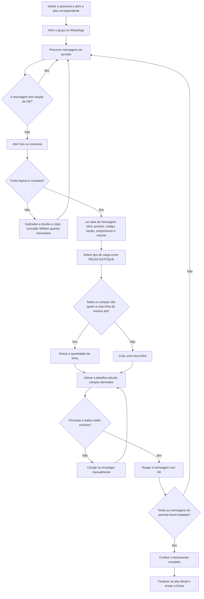

# Gaveta 04 — AS-IS

**Status:** fechada em 25/07/2026  
**Responsável pelo processo:** Lilian  
**Objetivo:** documentar como o fechamento é executado hoje, incluindo decisões, controles e retrabalho.

## 1. Fluxo atual

## 2. Passo a passo detalhado

| # | Responsável | Ação | Regra/controle | Saída |
|---|---|---|---|---|
| 1 | Lilian | Identifica a quinzena e abre sua aba na planilha “MEDIÇÕES AWL – 2026” | 1ª = 1–15; 2ª = 16–fim do mês | Período de trabalho definido |
| 2 | Lilian | Abre o grupo/conversa pertinente no WhatsApp Business | O tipo de carga deste fluxo é sempre PEÇAS ESTOQUE | Fonte selecionada |
| 3 | Lilian | Percorre as mensagens dentro do período | A data válida é a data da mensagem | Mensagens candidatas localizadas |
| 4 | Lilian | Verifica a reação de OK | Com OK = já processada; sem OK = analisar | Duplicação operacional evitada |
| 5 | Lilian | Abre a foto da etiqueta ou o romaneio | A evidência precisa estar legível e completa | Campos disponíveis para leitura |
| 6 | Lilian | Lê obra, Produto, código da peça, seção, comprimento e volume | Produto alimenta Tipo; seção + comprimento alimentam Dimensões | Dados normalizados mentalmente |
| 7 | Lilian | Compara o item com itens já coletados no mesmo dia | Todos os campos precisam ser iguais para agrupar | Decisão de consolidar ou separar |
| 8 | Lilian | Soma a quantidade ou cria nova linha | Datas diferentes nunca são agrupadas | Linha de medição preparada |
| 9 | Lilian | Digita os campos no Excel | Tipo de carga = PEÇAS ESTOQUE | Linha registrada |
| 10 | Excel | Calcula campos derivados pelas fórmulas e tabelas existentes | Não sobrescrever fórmulas | Volume total e valores calculados |
| 11 | Lilian | Confere a linha e resolve erros | Nunca adivinhar. Casos ilegíveis ou duvidosos são submetidos a Lilian, que consulta William quando necessário | Linha aceita, corrigida ou mantida pendente |
| 12 | Lilian | Aplica a reação de OK à mensagem | Somente depois de lançar todas as informações do romaneio ou da etiqueta | Mensagem marcada como integralmente processada |
| 13 | Lilian | Repete até terminar o período | Nenhuma mensagem pertinente sem tratamento | Quinzena preparada |
| 14 | Lilian | Faz a conferência final, conclui a aba oficial e envia a Deise | Aprovação permanece humana; não existe etapa posterior no escopo | Fechamento encerrado |

## 3. Regra formal de agrupamento

Duas ocorrências podem integrar a mesma linha somente quando todos estes valores forem iguais:

- data da mensagem;
- obra;
- tipo, obtido do campo Produto;
- código da peça;
- seção;
- comprimento;
- volume unitário;
- tipo de carga, neste processo sempre PEÇAS ESTOQUE.

Se qualquer campo for diferente, deve ser criada outra linha. Quando todos forem iguais, a quantidade é somada.

## 4. Controles atuais

- **Controle de processado:** reação de OK na mensagem do WhatsApp.
- **Controle de período:** data da mensagem, não data interna do romaneio.
- **Controle de agrupamento:** igualdade integral dos campos da chave.
- **Controle de cálculo:** fórmulas e tabelas existentes no Excel.
- **Controle de aprovação:** conferência humana antes da finalização.
- **Controle de dúvida:** nenhuma leitura incerta é inferida; Lilian decide e consulta William quando necessário.

## 5. Exceções e retrabalho observáveis

- Foto ilegível, cortada ou sem algum campo necessário: não adivinhar; encaminhar para Lilian.
- Romaneio com layout diferente, informação ausente ou duvidosa: não adivinhar; encaminhar para Lilian.
- Mensagem dentro do período sem evidência suficiente.
- Fórmula retornando erro ou cadastro sem correspondência.
- Conteúdo parcialmente lançado não pode receber OK; a reação só ocorre após o lançamento integral.
- Reação de OK ausente em conteúdo já lançado ou aplicada por engano.
- Peças parecidas, mas com diferença de código, seção, comprimento ou volume, que precisam permanecer separadas.
- Obra `CEJEN - PORTO IMBITUBA`: independentemente da peça ou do Produto, o Tipo lançado deve ser `METRO CÚBICO`, para que a cobrança seja calculada por `m³`.

## 6. Riscos do processo atual

- O OK é um controle visual e manual; pode ser esquecido, aplicado cedo demais ou removido.
- A chave de agrupamento é comparada manualmente, aumentando risco de juntar itens diferentes ou criar linhas desnecessárias.
- A alternância entre WhatsApp, visualizador e Excel aumenta tempo, esforço e risco de transcrição.
- A evidência de origem não fica ligada tecnicamente à linha da planilha.
- Uma mensagem pode conter vários itens, enquanto o OK existe no nível da mensagem.

## 7. Decisões finais aprovadas

- O OK só é aplicado depois que todas as informações do romaneio ou da etiqueta foram inseridas na planilha.
- Informação ilegível, incompleta ou duvidosa nunca é adivinhada; deve ser confirmada com Lilian.
- Lilian consulta William quando precisa esclarecer a origem e decide se o dado está correto.
- Existe outro grupo, mas ele não faz parte do escopo atual e deve ser ignorado nesta fase.
- O envio para Deise encerra o fechamento da quinzena; não existe etapa posterior neste processo.
- A regra da obra `CEJEN - PORTO IMBITUBA` tem prioridade: todas as suas peças são cobradas como `METRO CÚBICO`.

## 8. Critério de fechamento

Atendido: sequência, decisões, exceções, autoridade, fronteiras e término do processo foram confirmados pela responsável. A Gaveta 05 — Baseline — está liberada.
