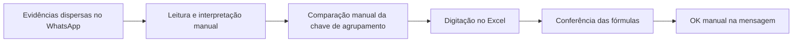

# Gaveta 06 — Diagnóstico

**Status:** fechada em 25/07/2026  
**Responsável pela validação:** Lilian  
**Objetivo:** identificar as causas do esforço manual antes de desenhar a solução futura.

## 1. Problema observado

Cada fechamento exige aproximadamente 3 horas para analisar 8.000–9.000 peças, localizar suas evidências no WhatsApp, interpretar fotos e romaneios, agrupar itens iguais, digitar registros no Excel, conferir resultados e marcar mensagens com OK.

## 2. Causa raiz proposta

O esforço não é causado apenas pelo número de peças. A causa principal é a ausência de um fluxo estruturado entre a evidência recebida no WhatsApp e a linha consolidada da planilha. Lilian precisa executar manualmente todas as transformações e todos os controles entre essas duas pontas.

## 3. Causas contribuintes

| Causa | Evidência | Consequência |
|---|---|---|
| Fontes separadas do destino | Alternância contínua entre WhatsApp, visualizador e Excel nos vídeos | Troca de contexto, cliques e risco de transcrição |
| Dois formatos de entrada | Fotos de etiquetas e romaneios em PDF | Regras de leitura diferentes para o mesmo resultado |
| Agrupamento mental | Igualdade de data, obra, produto, código, seção, comprimento e volume é comparada manualmente | Risco de juntar itens diferentes ou multiplicar linhas |
| Controle por reação | O OK no WhatsApp indica que a mensagem foi integralmente processada | Controle simples, porém dependente de ação humana e no nível da mensagem |
| Ausência de rastreabilidade técnica | A linha final não possui ligação automática com sua mensagem/foto/PDF | Conferência e investigação posteriores ficam mais lentas |
| Exceções dependem de pessoas | Dúvidas vão para Lilian, que pode consultar William | Correto para evitar invenção, mas cria espera e interrupção |
| Fórmulas/cadastros externos à evidência | Excel calcula campos derivados e pode retornar erros | Parte dos erros só aparece depois da digitação |

## 4. Cinco porquês resumidos

1. **Por que o fechamento consome tempo?** Porque cada movimentação precisa ser localizada, interpretada, agrupada, digitada e marcada manualmente.
2. **Por que essas ações são manuais?** Porque WhatsApp, anexos e planilha não compartilham um fluxo estruturado de dados.
3. **Por que não basta copiar o documento?** Porque a linha final depende de transformação: data da mensagem, normalização de campos e agrupamento integral.
4. **Por que o agrupamento exige atenção?** Porque qualquer diferença em código, produto, dimensão, volume, obra ou data cria outra linha.
5. **Por que não automatizar tudo sem revisão?** Porque imagens podem estar ilegíveis, dados podem gerar dúvida e a autoridade final precisa continuar com Lilian.

## 5. O que não deve ser tratado como causa

- A conferência humana não é desperdício: é um requisito de controle.
- Consultar Lilian/William em caso de dúvida não é falha: evita que o sistema invente dados.
- As fórmulas da planilha não devem ser substituídas sem necessidade: elas são parte do controle atual.
- O volume de 8.000–9.000 peças aumenta o impacto, mas não explica sozinho o retrabalho entre as fontes e a planilha.

## 6. Diagnóstico consolidado proposto

> O fechamento é demorado porque evidências sem integração chegam em dois formatos pelo WhatsApp e precisam ser transformadas manualmente em linhas agrupadas da planilha. O maior potencial de melhoria está em coletar, extrair, normalizar e agrupar os dados antes da conferência humana, preservando as fórmulas do Excel, a decisão de Lilian e o OK somente após a conclusão integral.

## 7. Critério de fechamento

Confirmado pela responsável:

1. que o maior esforço está em localizar, ler, comparar/agrupar e digitar as informações;
2. que a conferência humana e a consulta em caso de dúvida devem permanecer;
3. que o objetivo da automação é preparar linhas confiáveis para aprovação, e não decidir silenciosamente dados duvidosos.

Critério atendido. A Gaveta 07 — TO-BE — está aberta.
