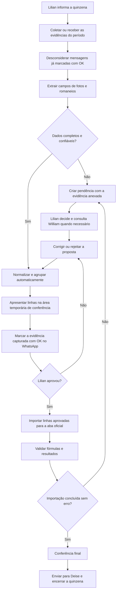

# Gaveta 07 — TO-BE

**Status:** fechada em 25/07/2026  
**Responsável pela aprovação:** Lilian  
**Objetivo:** definir como o fechamento deverá funcionar, sem escolher prematuramente a tecnologia.

## 1. Resultado futuro desejado

O fechamento deve deixar de exigir leitura, comparação, agrupamento e digitação integralmente manuais. As evidências da quinzena serão transformadas em linhas propostas e rastreáveis, apresentadas para conferência de Lilian antes de qualquer lançamento oficial.

## 2. Princípios obrigatórios

- A automação prepara; Lilian aprova.
- Nenhuma informação ilegível, ausente ou duvidosa pode ser inventada.
- A data válida continua sendo a data da mensagem no WhatsApp.
- O agrupamento continua obedecendo à chave confirmada na Gaveta 03.
- As fórmulas e tabelas da planilha oficial devem ser preservadas.
- No processo futuro, o OK deve ser aplicado assim que todas as informações da evidência forem capturadas na área temporária.
- Toda linha proposta deve apontar para sua mensagem, foto ou romaneio de origem.
- O envio para Deise continua encerrando o processo.

## 3. Fluxo futuro proposto

O mecanismo de coleta do WhatsApp, extração e aplicação do OK será decidido apenas na Gaveta 08 — Solução e TI. No TO-BE, o OK passa a significar **capturado na área temporária**, enquanto os estados aprovado e importado serão controlados separadamente nessa área.

## 4. Transformação automática esperada

Para cada evidência ainda sem OK, o processo futuro deverá:

1. registrar conversa, mensagem, data/hora, remetente e anexo de origem;
2. identificar obra, Produto/Tipo, código da peça, seção, comprimento e volume unitário;
3. aplicar a prioridade de Tipo: `CEJEN - PORTO IMBITUBA → METRO CÚBICO`; caso contrário, `Produto VIGA + Grupo TERÇA T → VIGA TERÇA`; depois aplicar as demais normalizações;
4. definir Tipo de Carga como **PEÇAS ESTOQUE**;
5. formar Dimensões com seção e comprimento;
6. comparar a chave de agrupamento;
7. somar quantidades apenas quando todos os campos forem iguais e a data da mensagem for a mesma;
8. manter separado qualquer item com diferença de data, obra, tipo, código, seção, comprimento ou volume;
9. encaminhar dados duvidosos para revisão, mostrando a evidência original;
10. produzir linhas para uma área temporária, nunca diretamente para a aba oficial;
11. conservar um histórico das aprovações, correções e rejeições.
12. não preencher volume total, unidade de medida, valor unitário ou valor total; esses quatro campos pertencem às fórmulas e à tabela da planilha.

## 5. Área temporária de conferência

Cada linha proposta deverá exibir, no mínimo:

| Grupo | Campos |
|---|---|
| Dados da medição | Tipo, data, obra, quantidade, peça, dimensões, volume unitário e tipo de carga |
| Origem | Conversa, remetente, data/hora da mensagem, nome do anexo e referência da página/foto |
| Qualidade | Completo, pendente, possível duplicidade ou erro de leitura |
| Decisão humana | Aprovar, corrigir ou rejeitar, com observação opcional |
| Processamento | Capturado/OK, pendente de revisão, aprovado, rejeitado e importado |

## 6. Autoridade no processo futuro

| Decisão | Automação | Lilian |
|---|---|---|
| Extrair campos legíveis | Propõe | Confere quando necessário |
| Agrupar itens integralmente iguais | Propõe/executa na área temporária | Pode corrigir |
| Interpretar campo duvidoso | Não decide | Decide; consulta William se necessário |
| Aprovar linha | Não | Sim |
| Importar para a aba oficial | Executa somente após autorização | Autoriza |
| Alterar fórmulas ou cadastros | Não | Decide fora deste fluxo |
| Aplicar OK | Depois que todas as informações da evidência forem gravadas na área temporária | Pode corrigir ou rejeitar posteriormente na área temporária |
| Enviar para Deise | Não automaticamente nesta fase | Sim |

## 7. Tratamento de exceções

- **Imagem ilegível:** gerar pendência e destacar os campos não lidos.
- **Campo ausente:** não criar valor padrão, exceto Tipo de Carga já definido como PEÇAS ESTOQUE.
- **Possível duplicidade:** não somar silenciosamente; mostrar as origens comparadas.
- **Item parcialmente capturado:** não aplicar OK à mensagem; o OK exige que todo o conteúdo da evidência esteja na área temporária.
- **Erro de fórmula/cadastro:** impedir conclusão da importação e encaminhar para revisão.
- **Outro grupo:** ignorar, pois está fora do escopo atual.
- **CEJEN - PORTO IMBITUBA:** forçar apenas o Tipo `METRO CÚBICO`; unidade, volume total, valor unitário e valor total são responsabilidade das fórmulas e da tabela oficial da planilha.
- **Viga Terça:** fora da exceção CEJEN, Produto `VIGA` com Grupo `TERÇA T` deve gerar Tipo `VIGA TERÇA`, cuja unidade oficial é metro linear (`m`). Não usar `TERÇA I`.

## 8. Critérios de sucesso

- Lilian deixa de transcrever manualmente todos os dados legíveis.
- O trabalho humano concentra-se em conferência e exceções.
- Nenhuma linha entra na aba oficial sem aprovação.
- Nenhuma mensagem recebe OK antes da captura integral na área temporária.
- Toda linha pode ser rastreada até sua origem.
- Itens diferentes nunca são agrupados.
- Informações duvidosas nunca são inventadas.

## 9. Decisões aprovadas

1. A automação agrupa apenas peças da mesma data de mensagem e com todas as informações iguais.
2. Lilian revisa os resultados na área temporária.
3. O OK é aplicado à mensagem/foto no WhatsApp assim que os dados forem integralmente colocados na área temporária.
4. O envio para Deise continua manual.
5. A área temporária permite aprovar, corrigir/editar e rejeitar registros.
6. Cada fechamento começa com uma nova seleção de mês, ano e quinzena. Dados usados em testes não entram na aba oficial; somente mensagens do período escolhido e linhas aprovadas participam da importação.
7. Toda peça da obra `CEJEN - PORTO IMBITUBA` é tratada como `METRO CÚBICO`, independentemente do Produto ou código da peça.
8. No fechamento real, cada linha agrupada recebe obrigatoriamente a data da mensagem do WhatsApp que originou as peças. Linhas sem essa data não podem ser importadas. Se peças iguais vierem de mensagens em dias diferentes, permanecem em linhas separadas; se estiverem na mesma mensagem ou no mesmo dia e todos os demais campos forem idênticos, podem ser agrupadas conforme a regra confirmada.
9. Mensagem textual no padrão `16x10=600` gera Tipo `ESTACA`, Peça `16` e Quantidade `6.000`, calculada por `10 × 600`. Dimensões e Volume unitário permanecem vazios. Se qualquer parte estiver ausente ou ilegível, a entrada fica pendente.

## 10. Critério de fechamento

Atendido: resultado, regras, autoridade, exceções, momento do OK e encerramento foram confirmados. A Gaveta 08 — Solução e TI — está aberta.
