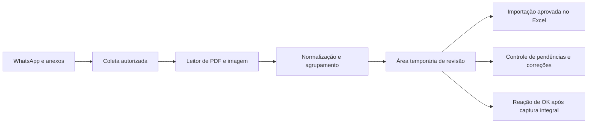

# Gaveta 08 — Solução e TI

**Status:** fechada em 25/07/2026 — prova completa aprovada, incluindo importação de linha nova na cópia e replicação das fórmulas  
**Responsável pela decisão:** Lilian  
**Objetivo:** selecionar e provar a tecnologia necessária para executar o TO-BE.

## 1. Capacidades necessárias

A solução precisa:

1. receber ou localizar mensagens da quinzena no grupo em escopo;
2. ignorar evidências já marcadas com OK;
3. obter fotos e romaneios sem reduzir a qualidade;
4. ler PDFs tabulares e fotos de etiquetas;
5. aplicar as regras de normalização e agrupamento;
6. gravar tudo em uma área temporária rastreável;
7. aplicar OK somente após a captura integral nessa área;
8. permitir que Lilian aprove, edite/corrija ou rejeite;
9. importar somente linhas aprovadas para a planilha oficial;
10. preservar e validar as fórmulas existentes;
11. manter estados distintos para capturado/OK, aprovado e importado.

## 2. Arquitetura lógica proposta

## 3. Componentes propostos

| Componente | Responsabilidade | Decisão atual |
|---|---|---|
| Coletor de evidências | Obter mensagem, data e anexo; verificar/aplicar OK | Seleção por data, leitura, IDs, captura das páginas e reação 🆗 validadas pelo WhatsApp Web |
| Extrator de romaneio | Ler tabelas e cabeçalhos do PDF | Os PDFs testados são imagens sem camada de texto; exigem OCR/visão, com validação |
| Leitor de etiqueta | Extrair campos visuais da foto | OCR/visão com validação e confiança; nunca preencher dúvida silenciosamente |
| Motor de regras | Normalizar campos, aplicar exceções prioritárias por obra e executar a chave de agrupamento | Script determinístico; prioridade: `CEJEN - PORTO IMBITUBA → METRO CÚBICO`, depois `VIGA + TERÇA T → VIGA TERÇA`, depois demais regras; não calcular volume total |
| Área temporária | Exibir linhas, origem, estado e ações de revisão | Aba auxiliar validada como primeira versão do piloto |
| Importador do Excel | Inserir somente os campos de origem das linhas aprovadas e preservar fórmulas | Não escrever em volume total, unidade de medida, valor unitário ou valor total; script controlado sobre cópia segura |
| Log | Relacionar evidência, linha, correção, aprovação, importação e OK | Obrigatório |

## 4. Alternativas para a área temporária

### Alternativa A — Aba auxiliar no próprio Excel

- Menor mudança para Lilian.
- Mais rápida para um primeiro piloto.
- Pode usar colunas de status e botões/macros para aprovar, editar e rejeitar.
- Exige cuidado para não misturar fórmulas oficiais e dados temporários.

### Alternativa B — Aplicação local de revisão

- Melhor visualização da foto/PDF ao lado da linha extraída.
- Estados e rastreabilidade mais claros.
- Facilita correções, rejeições e auditoria.
- Exige mais construção e manutenção do que uma aba auxiliar.

**Direção inicial recomendada:** provar primeiro a extração e a integração com uma aba auxiliar em uma cópia da planilha. Migrar para aplicação local somente se a revisão no Excel ficar limitada ou confusa.

## 4.1 Resultado da prova técnica local

A prova foi executada em uma cópia da planilha oficial com os arquivos fornecidos em 25/07/2026. O resultado detalhado está em `Prova_Tecnica_Gaveta_08.md`.

- A aba `CONFERÊNCIA AUTO` foi criada sem modificar o arquivo original.
- Foram preparados 27 agrupamentos, todos ligados à evidência de origem.
- A Carga 29 gerou `VIGA TERÇA / TP1 / quantidade 21` e coincidiu com a linha já lançada em `2ª quinz.julho`.
- As fórmulas de volume total, unidade, valor unitário e valor total foram preservadas e verificadas sem erros na nova aba.
- A área temporária oferece as ações `APROVAR`, `EDITAR` e `REJEITAR`.
- Datas ausentes permaneceram pendentes. A data do romaneio ou a marca da câmera não foi usada como data da mensagem.
- A classificação de Tipo exige normalização; não é sempre uma cópia literal de Produto.
- A arquitetura local recomendada para o piloto é: OCR/visão com confiança + motor determinístico de regras + aba temporária no Excel.

## 4.2 Prova de leitura no WhatsApp Web

Com autorização de Lilian e a sessão vinculada em 25/07/2026, foi executado um teste somente de leitura no grupo `AWL x Expedição Prellog`.

- O grupo foi localizado automaticamente.
- O histórico da segunda quinzena pôde ser carregado.
- Foram reconhecidas as datas completas de 16, 17 e 18/07/2026 e os dias subsequentes.
- O PDF `Carga 115.pdf`, fotos avulsas e álbuns de mídia foram localizados no grupo.
- As mídias apresentam identificadores únicos, utilizáveis para rastreabilidade e prevenção de duplicidade.
- A visualização da conversa indica quando Lilian reagiu com 🆗.
- Nenhum anexo foi baixado e nenhuma reação foi aplicada durante esta etapa de leitura.

Essa prova elimina a necessidade de Lilian baixar ou datar arquivos manualmente. A etapa seguinte validou a captura do conteúdo e a aplicação do 🆗.

## 4.3 Regra de início do fechamento aprovada

Lilian escolhe uma única vez o `mês + ano + 1ª ou 2ª quinzena`. A automação calcula o intervalo e usa o calendário do WhatsApp para chegar à primeira data:

- 1ª quinzena: dia 1 ao dia 15;
- 2ª quinzena: dia 16 ao último dia do mês.

Depois disso, cada evidência recebe automaticamente a data da própria mensagem. A data do romaneio não substitui a data do WhatsApp. A prova navegou diretamente para 16/07/2026 e mostrou a fronteira com 15/07/2026.

## 4.4 Prova de captura e reação

A mensagem `Carga 29.pdf`, de 16/07/2026 às 07:32, foi usada no teste controlado:

1. o PDF foi aberto automaticamente no visualizador do WhatsApp;
2. as duas páginas foram disponibilizadas e conferidas;
3. o agrupamento de 21 peças `TP1` já validado foi confirmado na área temporária;
4. somente depois disso, a reação da mensagem foi alterada de 👍 para 🆗;
5. a conversa passou a exibir `Você reagiu com 🆗` para a Carga 29.

O visualizador disponibilizou as duas páginas para processamento sem ação manual de Lilian. A exportação do arquivo bruto pelo navegador de prova não foi necessária para esta validação e permanece como requisito de robustez para a implementação definitiva.

## 5. Decisões que exigem prova, não suposição

- Como acessar as mensagens e anexos do grupo de maneira autorizada e estável.
- Se o mecanismo escolhido consegue ler o histórico necessário, e não apenas mensagens futuras.
- Se é possível aplicar a reação de OK programaticamente no contexto atual.
- Se fotos e PDFs originais podem ser obtidos com qualidade suficiente.
- Como a planilha oficial replica fórmulas, validações e tabelas para novas linhas.
- Qual precisão é atingida nas etiquetas reais e quais campos devem sempre exigir revisão.

Na prova local, os itens de planilha, extração, agrupamento e revisão foram demonstrados. No WhatsApp Web, também foram demonstrados seleção da data inicial, acesso ao histórico, captura integral e aplicação automática do 🆗 no momento correto. O teste seguro da Carga 29 localizou a chave já existente em `2ª quinz.julho!A7:M7` e bloqueou uma segunda inclusão. Depois da aprovação de Lilian, a etiqueta `PL-14-B`, enviada em 24/07/2026 às 10:46, foi importada em `2ª quinz.julho!A11:M11`. A automação escreveu somente os campos de origem; as fórmulas calcularam volume total, unidade de medida, valor unitário e valor total sem erros.

As linhas 8, 9 e 10 da cópia usada na prova eram exemplos preexistentes e estavam sem data. Isso não representa o fechamento real. Na execução definitiva, a automação obtém no WhatsApp a data correspondente a cada mensagem e a associa ao agrupamento de cada tipo/peça. A validação deve impedir a importação de qualquer linha cuja data da mensagem esteja vazia.

## 6. Insumos necessários para a prova técnica

- Uma cópia segura e editável da planilha “MEDIÇÕES AWL – 2026”.
- Pelo menos 3 romaneios originais representativos.
- Pelo menos 10 fotos originais de etiquetas, incluindo exemplos fáceis e difíceis.
- Informação sobre o tipo de conta/configuração atual do WhatsApp Business.
- Confirmação de que o piloto pode ser feito sem alterar o fechamento oficial.

## 7. Critério para fechar a Gaveta 08

A gaveta será fechada depois de uma prova pequena demonstrar que:

1. os anexos podem ser obtidos de forma autorizada;
2. romaneios e etiquetas podem ser transformados nos campos exigidos;
3. o agrupamento reproduz as decisões de Lilian;
4. a área temporária permite revisar e editar;
5. o OK pode ser aplicado no momento correto ou existe um fallback operacional aprovado;
6. linhas aprovadas entram em uma cópia da planilha sem quebrar fórmulas.

Critério atendido em 25/07/2026. A Gaveta 09 — Contratos — pode ser aberta.
