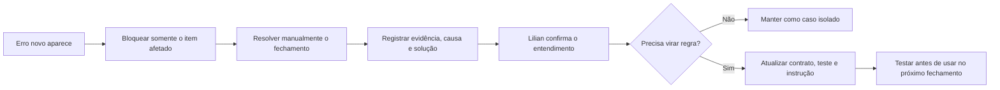

# Gaveta 11 — Medição Contínua

**Status:** fechada em 25/07/2026  
**Responsável pela avaliação:** Lilian  
**Objetivo:** acompanhar o funcionamento real sem transformar o controle em trabalho manual adicional.

## 1. Princípio

O go-live não encerra a análise. Cada fechamento gera um resumo simples para comparar o resultado real com a baseline e identificar erros novos.

A baseline aprovada para uso próprio é:

- aproximadamente 3 horas por fechamento;
- aproximadamente 8.000 a 9.000 peças analisadas por fechamento.

## 2. Indicadores mínimos

### Indicadores principais

| Indicador | Como medir | Uso |
|---|---|---|
| Tempo total do fechamento | Do início da execução até o estado `ENCERRADA` | Comparar com a baseline de 3 horas |
| Peças analisadas | Soma das quantidades das evidências do período | Dar contexto ao tempo; referência de 8.000–9.000 peças |

### Controles de segurança

| Indicador | Resultado esperado |
|---|---|
| Linhas importadas sem data da mensagem | 0 |
| Duplicidades efetivamente importadas | 0 |
| Linhas importadas com erro de fórmula | 0 |
| Pendências restantes | Mostrar a quantidade e o motivo |
| 🆗 pendentes | Mostrar a quantidade e permitir resolução manual |

## 3. Resumo de cada fechamento

Ao encerrar, a automação deverá criar automaticamente um resumo com:

- mês, ano e quinzena;
- início, fim e duração;
- peças analisadas;
- mensagens e evidências processadas;
- linhas aprovadas, editadas, rejeitadas e importadas;
- pendências;
- duplicidades bloqueadas;
- erros de fórmula;
- 🆗 pendentes;
- backup utilizado;
- confirmação de envio para Deise.

O resumo não exige preenchimento manual dos números. A automação coleta os dados do próprio log.

## 4. Ciclo de erro novo

Uma ocorrência não vira regra automaticamente. Primeiro ela é resolvida, entendida e aprovada por Lilian.

## 5. Revisão do piloto

Nos três primeiros fechamentos reais, Lilian deverá olhar o resumo ao final e confirmar:

- se o tempo está diminuindo;
- se a quantidade de peças está coerente;
- se houve algum lançamento incorreto;
- se as pendências foram claras;
- se foi necessário fazer trabalho manual não previsto.

Depois de três fechamentos sem duplicidade importada, linha sem data ou erro de fórmula não resolvido, a rotina pode ser considerada estável. Isso não impede melhorias futuras.

## 6. Decisões para validação

| ID | Decisão proposta |
|---|---|
| D11-01 | **Confirmado:** criar automaticamente uma aba `RESUMO EXECUÇÃO` na planilha, sem preenchimento manual |
| D11-02 | **Confirmado:** manter como principais somente Tempo total e Peças analisadas; os demais números funcionam como alertas de segurança |
| D11-03 | **Confirmado:** revisar com atenção os três primeiros fechamentos reais antes de considerar a rotina estável |

## 7. Critério de fechamento

Atendido em 25/07/2026: Lilian validou os indicadores, a aba automática `RESUMO EXECUÇÃO`, os alertas de segurança e a revisão dos três primeiros fechamentos. O Método das 12 Gavetas está concluído para esta fase do projeto.
