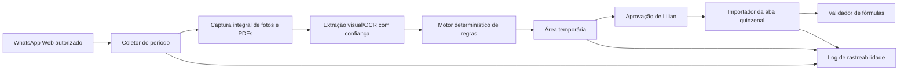

# SRS/ETO — Automação do Fechamento Quinzenal WL

**Versão:** 1.0 — validada em 25/07/2026  
**Origem funcional:** `PRD_Fechamento_WL.md`

## 1. Arquitetura contratada

### 1.1 Formato de entrega

A solução será distribuída como aplicativo instalado no Windows, com instalador próprio e atalho na área de trabalho. Não dependerá de loja de aplicativos. Na primeira execução, o aplicativo orientará Lilian a selecionar a planilha oficial e confirmar a sessão autorizada do WhatsApp Web. Configurações válidas serão memorizadas para as execuções seguintes.

## 2. Componentes

### 2.1 Seletor de período

Entrada: mês, ano e quinzena.  
Saída: data inicial, data final e nome esperado da aba.

Deve rejeitar período inválido e impedir mistura entre execuções.

### 2.2 Coletor do WhatsApp

- usar somente a sessão autorizada de Lilian;
- localizar o grupo pelo nome exato;
- navegar até a data inicial e percorrer até a data final;
- registrar um identificador estável da mensagem, remetente, data/hora e tipo de mídia;
- detectar a reação 🆗 da própria conta;
- não enviar mensagens;
- aplicar 🆗 somente quando o estado da evidência mudar para `CAPTURADO`.

### 2.3 Capturador de evidência

- fotos: obter resolução suficiente para leitura;
- PDFs: processar todas as páginas;
- álbuns: processar todos os itens;
- impedir estado `CAPTURADO` enquanto houver página ou mídia não processada;
- conservar referência para retornar à mensagem original.

### 2.4 Extrator

Campos mínimos:

- Obra;
- Produto;
- Grupo, quando existir;
- código da Peça;
- Seção;
- Comprimento;
- Volume unitário;
- quantidade ou linhas individuais do romaneio.

Cada campo deverá guardar valor, fonte e estado de confiança. Campo duvidoso fica vazio e gera pendência.

O extrator também deverá reconhecer mensagens textuais de Estaca com três grupos numéricos: `peça x multiplicador = valor-base`. Para `16x10=600`, persistir Peça `16`, calcular Quantidade `10 * 600 = 6000`, definir Tipo `ESTACA` e manter Dimensões e Volume unitário vazios. O parser deve aceitar espaços ao redor de `x` e `=`, mas rejeitar texto incompleto ou ambíguo.

### 2.5 Motor de regras

O motor deve ser determinístico e versionado. Ordem obrigatória:

1. normalizar texto sem alterar o significado;
2. aplicar exceção `CEJEN - PORTO IMBITUBA`;
3. aplicar `VIGA + TERÇA T`;
4. classificar demais Produtos;
5. classificar vigas por comprimento;
6. formar Dimensões;
7. fixar `PEÇAS ESTOQUE`;
8. montar a chave de agrupamento;
9. agrupar apenas chaves idênticas;
10. verificar duplicidade.

### 2.6 Área temporária

Estados permitidos:

`PENDENTE`, `CAPTURADO`, `APROVADO`, `EDITADO`, `REJEITADO`, `IMPORTADO`, `DUPLICIDADE BLOQUEADA`, `ERRO DE IMPORTAÇÃO`.

Cada linha deverá mostrar campos de medição, origem, qualidade, observação, decisão e estado. As ações humanas são `APROVAR`, `EDITAR` e `REJEITAR`.

### 2.7 Importador do Excel

Pré-condições:

- período e aba compatíveis;
- linha aprovada;
- data preenchida;
- chave não existente;
- planilha disponível para escrita;
- fórmulas-base identificadas.

Escrita permitida: Tipo, Data, Obra, Quantidade, Peça, Dimensões, Volume unitário e Tipo de carga.

O importador deve replicar as fórmulas relativas de Volume total, Unidade de medida, Valor unitário e Valor total, sem substituir esses campos por valores fixos.

Pós-condições:

- fórmula presente nos quatro campos;
- nenhum `#REF!`, `#DIV/0!`, `#VALUE!`, `#NAME?`, `#N/A`, `#VALOR!` ou `#N/D` na linha importada;
- chave persistida no log;
- estado alterado para `IMPORTADO`.

### 2.8 Log

Cada evento deverá registrar:

- execução e período;
- mensagem e evidência;
- chave antes e depois de correções;
- estado anterior e novo;
- ação automática ou humana;
- responsável pela aprovação;
- linha e aba de destino;
- resultado e erro, quando houver.

Os eventos serão mantidos por 12 meses. A limpeza automática poderá remover registros mais antigos, sem apagar a planilha oficial nem seus backups ainda necessários.

## 3. Integridade e recuperação

- nunca alterar a planilha enquanto houver dúvida de destino;
- escrever de forma transacional: preparar, validar e somente então concluir;
- em erro, manter a linha temporária e registrar `ERRO DE IMPORTAÇÃO`;
- não remover 🆗 automaticamente por erro posterior; registrar a pendência na área temporária;
- nunca sobrescrever fórmulas, preços ou cadastros sem uma mudança de escopo aprovada;
- criar uma cópia de segurança automática da planilha antes de cada importação;
- executar no computador de Lilian, reutilizando apenas a sessão autorizada do WhatsApp nesse equipamento;
- se a reação automática falhar, registrar `OK PENDENTE`, avisar Lilian e permitir que ela aplique o 🆗 manualmente sem perder o restante do processamento.

## 4. Segurança e acesso

- não armazenar senha do WhatsApp em código ou log;
- reutilizar somente sessão autorizada no equipamento definido;
- restringir planilha e logs aos usuários autorizados;
- não registrar conteúdo pessoal de conversas fora do grupo em escopo;
- não enviar dados a serviços externos sem aprovação específica.

## 5. Requisitos não funcionais mínimos

- rastreabilidade de 100% das linhas importadas;
- idempotência: repetir a execução não duplica registros;
- falha segura: dúvida ou erro impede escrita;
- execução observável por estados e log;
- retomada após interrupção sem perder o que já foi capturado;
- suporte ao volume de 8.000–9.000 peças por fechamento por meio de agrupamento, sem exigir uma linha por peça física.
- instalação no Windows por fluxo simples, com atalho na área de trabalho e possibilidade de atualização por nova versão do instalador.

## 6. Testes contratuais mínimos

1. PDF com mais de uma página.
2. Álbum com várias fotos.
3. Etiqueta legível.
4. Etiqueta ilegível.
5. Mesma peça no mesmo dia.
6. Mesma peça em dias diferentes.
7. `CEJEN - PORTO IMBITUBA`.
8. `VIGA + TERÇA T`.
9. Duplicidade já presente na aba.
10. Linha nova aprovada.
11. Fórmula ou cadastro com erro.
12. Interrupção e retomada.
13. Mensagem textual `16x10=600`, esperando ESTACA, Peça 16, Quantidade 6.000 e campos de Dimensões/Volume unitário vazios.
